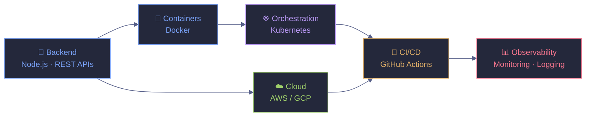

<!-- ===================== HEADER ===================== -->

<!-- ===================== BADGES ===================== -->

  
  
  

  

<!-- ===================== TYPING ===================== -->

  

---

## ⚡ About Me

- 🚀 Full Stack Developer with strong **backend focus**
- ⚙️ Building **real-world scalable applications**
- ☸️ Learning **DevOps fundamentals (Docker, Kubernetes)**
- 🧠 Interested in **system design & architecture**

---

### 🛠️ Tech Stack

  

---

### 📊 Core Languages Used

  

---

## ⚙️ Core Skills

### 💻 Backend
- REST API design
- Authentication (JWT, sessions)
- Database design (MongoDB, PostgreSQL)

### 🎨 Frontend
- React.js / Next.js
- Zustand (state management)
- Tailwind CSS

### 🐳 DevOps (Basics)
- Docker (containerization)
- Kubernetes (basic deployments)
- GitHub Actions (CI/CD basics)
- Nginx (reverse proxy basics)

---

## 🧠 System Thinking

<pre>
Client → Server → Database
        ↓
     Cache
        ↓
   Background Jobs
</pre>

---

## 🚀 Projects

| 📦 Project | 📝 Description | 🛠️ Tech Stack | 🔗 Link |
|------------|----------------|----------------|---------|
| 💬 **Chatify** | Real-time chat application with authentication & messaging | Node.js · Socket.io · MongoDB · React | [Repo](https://github.com/amiitdev/chatify) |
| 🔐 **DevOps Auth App** | Production-style auth app containerized & deployed with DevOps tooling | React · Docker · Nginx · CI/CD | [Repo](https://github.com/amiitdev/devops-auth-app) |

  
  

---

## 🏆 GitHub Trophies

  

---

## 📈 GitHub Stats

  
  

---

## 📊 Contribution Activity

  

---

## 🐍 Watch the Snake Eat My Contributions

  <picture>
    <source media="(prefers-color-scheme: dark)" srcset="https://raw.githubusercontent.com/amiitdev/amiitdev/output/github-contribution-grid-snake-dark.svg" />
    <source media="(prefers-color-scheme: light)" srcset="https://raw.githubusercontent.com/amiitdev/amiitdev/output/github-contribution-grid-snake.svg" />
    
  </picture>

---

## 🗺️ Learning Roadmap

**Current focus:**
- ✅ Docker basics
- 🔄 Kubernetes (deployments, scaling basics)
- ⬜ AWS / GCP fundamentals
- ⬜ Monitoring & logging (Prometheus, Grafana)

---

## 🤝 Connect With Me

  
  
  

---

  💡 <i>Consistently learning and building better systems.</i>

